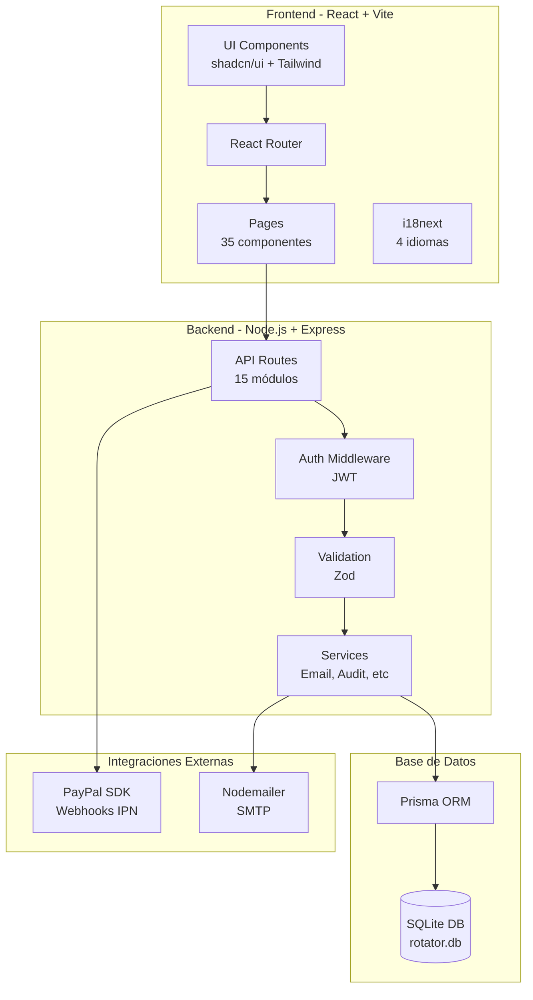

# Sistema de Usuarios - Rotator Survey

**Sistema moderno de gestión de usuarios, licencias, CRM e infraestructura**

Migrado de PHP a Node.js + React con arquitectura moderna y escalable.

**Estado:** ✅ **LISTO PARA PRODUCCIÓN** (~95% Completo)

---

## 📋 Tabla de Contenidos

1. [Inicio Rápido](#-inicio-rápido)
2. [Arquitectura del Sistema](#-arquitectura-del-sistema)
3. [Rutas del Backend (API)](#-rutas-del-backend-api)
4. [Rutas del Frontend](#-rutas-del-frontend)
5. [Tecnologías](#-tecnologías)
6. [Funcionalidades](#-funcionalidades)
7. [Módulos Especiales](#-módulos-especiales)
8. [Tests y Calidad](#-tests-y-calidad)
9. [Deployment](#-deployment)
10. [Seguridad](#-seguridad)

---

## 🚀 Inicio Rápido

### Desarrollo Local

```bash
# 1. Clonar repositorio
git clone <repo-url>
cd SistemaDeUsuarios

# 2. Instalar dependencias
npm install

# 3. Configurar variables de entorno
cp .env.example .env
# Editar .env con tus configuraciones

# 4. Generar Prisma Client
npm -w backend exec prisma generate

# 5. Aplicar esquema a la base de datos (SQLite)
npm -w backend exec prisma db push

# 6. Seed de datos base y demo
npm run seed
# Seeding: `npm run seed`
# Test: `npm test`
# Herramientas de Mantenimiento: `maintenance-tools/`

# 7. Ejecutar Servidores (Backend: 3005, Frontend: 5180)
npm run dev:all

# 8. Ejecutar Tests
npm test
```

**Acceso:**
- Frontend: http://localhost:5180
- Backend API: http://localhost:3005/api
- Swagger Docs: http://localhost:3005/api-docs

**Credenciales de Organización Master:**
- Email: `admin@rotatorsurvey.com`
- Password: `RotatorAdmin2026!`

### Producción

```bash
# Build completo
npm run build

# Iniciar servidor (NODE_ENV=production)
npm start
```

Ver **[DEPLOYMENT.md](./DEPLOYMENT.md)** para guía completa de deployment con Nginx, PM2 y SSL.

---

## 🏗️ Arquitectura del Sistema

### Diagrama de Arquitectura



### Estructura de Directorios

```
SistemaDeUsuarios/
├── backend/                          # Backend Node.js + Express
│   ├── src/
│   │   ├── routes/                   # 15 módulos de rutas API
│   │   │   ├── auth.js              # Autenticación (usuarios y organizaciones)
│   │   │   ├── users.js             # CRUD de usuarios
│   │   │   ├── licenses.js          # Gestión de licencias
│   │   │   ├── activations.js       # Activaciones de licencias
│   │   │   ├── crm.js               # CRM y organizaciones
│   │   │   ├── prospects.js         # Pipeline de prospectos
│   │   │   ├── clients.js           # Gestión de clientes
│   │   │   ├── servers.js           # Infraestructura de servidores
│   │   │   ├── domains.js           # Gestión de dominios
│   │   │   ├── catalog.js           # Catálogos del sistema
│   │   │   ├── audit.js             # Auditoría de acciones
│   │   │   ├── backup.js            # Backup y restore
│   │   │   ├── paypal.js            # Integración PayPal
│   │   │   ├── notifications.js     # Sistema de notificaciones
│   │   │   └── me.js                # Perfil de usuario
│   │   ├── middleware/               # Middleware de Express
│   │   │   ├── auth.js              # Autenticación JWT
│   │   │   ├── roles.js             # Verificación de roles
│   │   │   ├── validate.js          # Validación con Zod
│   │   │   └── security.js          # Helmet, CORS, Rate Limiting
│   │   ├── services/                 # Lógica de negocio
│   │   │   ├── email.service.js     # Envío de emails multi-idioma
│   │   │   ├── audit.service.js     # Registro de auditoría
│   │   │   ├── license.service.js   # Generación de licencias
│   │   │   └── paypal.service.js    # Procesamiento PayPal
│   │   ├── config/                   # Configuración
│   │   │   ├── prismaClient.js      # Cliente Prisma
│   │   │   └── swagger.js           # Configuración Swagger
│   │   ├── validation/               # Schemas de validación
│   │   │   └── schemas.js           # Schemas Zod
│   │   └── index.js                  # Punto de entrada
│   ├── prisma/
│   │   ├── schema.prisma            # Schema de base de datos
│   │   └── rotator.db               # Base de datos SQLite
├── maintenance-tools/             # Herramientas de mantenimiento
│   ├── add-file-headers.js       # Utilidad para headers
│   └── export_schema_json.cjs    # Exportador de schema
│   ├── __tests__/                    # 28 tests automatizados
│   └── package.json
├── frontend/                         # Frontend React + Vite
│   └── src/
│       ├── pages/                    # 35 páginas de la aplicación
│       ├── components/               # Componentes reutilizables
│       │   ├── ui/                  # shadcn/ui components
│       │   ├── FilterBar.jsx
│       │   ├── DataTable.jsx
│       │   └── ...
│       ├── layouts/                  # Layouts de la app
│       ├── locales/                  # Traducciones i18n
│       │   ├── es/                  # Español
│       │   ├── en/                  # Inglés
│       │   ├── pt/                  # Portugués
│       │   └── fr/                  # Francés
│       ├── utils/                    # Utilidades
│       └── App.jsx                   # Componente raíz
├── docs/                             # Documentación adicional
└── package.json                      # Workspace root
```

---

## 📡 Rutas del Backend (API)

**Base URL:** `/api`

**Documentación Interactiva:** http://localhost:3001/api-docs (Swagger UI)

### 1. Autenticación (`/api/auth`)

| Método | Ruta | Descripción | Auth | Rol |
|--------|------|-------------|------|-----|
| POST | `/login` | Login de usuario | ❌ | - |
| POST | `/register` | Registro de usuario (admin) | ✅ | MASTER |
| POST | `/register-public` | Registro público | ❌ | - |
| POST | `/refresh` | Renovar access token | ❌ | - |
| POST | `/logout` | Cerrar sesión | ❌ | - |
| POST | `/forgot-password` | Solicitar recuperación | ❌ | - |
| POST | `/reset-password` | Resetear contraseña | ❌ | - |
| POST | `/organization/login` | Login de organización | ❌ | - |

### 2. Perfil de Usuario (`/api/me`)

| Método | Ruta | Descripción | Auth | Rol |
|--------|------|-------------|------|-----|
| GET | `/` | Obtener perfil | ✅ | - |
| PUT | `/` | Actualizar perfil | ✅ | - |
| PUT | `/password` | Cambiar contraseña | ✅ | - |

### 3. Usuarios (`/api/users`)

| Método | Ruta | Descripción | Auth | Rol |
|--------|------|-------------|------|-----|
| GET | `/` | Listar usuarios | ✅ | MASTER |
| GET | `/:id` | Obtener usuario | ✅ | MASTER |
| POST | `/` | Crear usuario | ✅ | MASTER |
| PUT | `/:id` | Actualizar usuario | ✅ | MASTER |
| DELETE | `/:id` | Eliminar usuario | ✅ | MASTER |

### 4. Licencias (`/api/licenses`)

| Método | Ruta | Descripción | Auth | Rol |
|--------|------|-------------|------|-----|
| GET | `/` | Listar licencias | ✅ | MASTER |
| GET | `/:id` | Obtener licencia | ✅ | MASTER |
| POST | `/` | Crear licencia | ✅ | MASTER |
| POST | `/generate` | Generar serial/clave | ✅ | MASTER |
| PUT | `/:id` | Actualizar licencia | ✅ | MASTER |
| DELETE | `/:id` | Eliminar licencia | ✅ | MASTER |
| DELETE | `/:id/activations` | Eliminar activaciones | ✅ | MASTER |

### 5. Activaciones (`/api/activations`)

| Método | Ruta | Descripción | Auth | Rol |
|--------|------|-------------|------|-----|
| GET | `/` | Listar activaciones | ✅ | MASTER |
| POST | `/` | Crear activación | ✅ | MASTER |
| PUT | `/:id` | Actualizar activación | ✅ | MASTER |
| DELETE | `/:id` | Eliminar activación | ✅ | MASTER |

### 6. CRM y Organizaciones (`/api/crm`)

| Método | Ruta | Descripción | Auth | Rol |
|--------|------|-------------|------|-----|
| GET | `/metrics` | Métricas CRM | ✅ | - |
| GET | `/churn-by-country` | Churn por país | ✅ | - |
| GET | `/upselling` | Oportunidades upselling | ✅ | - |
| GET | `/organizations` | Listar organizaciones | ✅ | - |
| POST | `/organizations` | Crear organización | ✅ | - |
| PUT | `/organizations/:id` | Actualizar organización | ✅ | - |
| DELETE | `/organizations/:id` | Eliminar organización | ✅ | - |

### 7. Prospectos (`/api/prospects`)

| Método | Ruta | Descripción | Auth | Rol |
|--------|------|-------------|------|-----|
| GET | `/` | Listar prospectos | ✅ | MASTER |
| GET | `/:id` | Obtener prospecto | ✅ | MASTER |
| POST | `/` | Crear prospecto | ✅ | MASTER |
| PUT | `/:id` | Actualizar prospecto | ✅ | MASTER |
| DELETE | `/:id` | Eliminar prospecto | ✅ | MASTER |
| POST | `/:id/convert` | Convertir a cliente | ✅ | MASTER |

### 8. Clientes (`/api/clients`)

| Método | Ruta | Descripción | Auth | Rol |
|--------|------|-------------|------|-----|
| GET | `/` | Listar clientes | ✅ | MASTER |
| GET | `/active` | Clientes activos | ✅ | MASTER |
| GET | `/crm-stats` | Estadísticas CRM | ✅ | MASTER |
| GET | `/:id` | Obtener cliente | ✅ | MASTER |
| PUT | `/:id` | Actualizar cliente | ✅ | MASTER |

### 9. Servidores (`/api/servers`)

| Método | Ruta | Descripción | Auth | Rol |
|--------|------|-------------|------|-----|
| GET | `/` | Listar servidores | ✅ | MASTER |
| GET | `/:id` | Obtener servidor | ✅ | MASTER |
| GET | `/costs` | Calcular costos totales | ✅ | MASTER |
| GET | `/expiring` | Servidores por vencer | ✅ | MASTER |
| POST | `/` | Crear servidor | ✅ | MASTER |
| PUT | `/:id` | Actualizar servidor | ✅ | MASTER |
| DELETE | `/:id` | Eliminar servidor | ✅ | MASTER |

### 10. Dominios (`/api/domains`)

| Método | Ruta | Descripción | Auth | Rol |
|--------|------|-------------|------|-----|
| GET | `/` | Listar dominios | ✅ | MASTER |
| GET | `/:id` | Obtener dominio | ✅ | MASTER |
| POST | `/` | Crear dominio | ✅ | MASTER |
| PUT | `/:id` | Actualizar dominio | ✅ | MASTER |
| DELETE | `/:id` | Eliminar dominio | ✅ | MASTER |

### 11. Catálogos (`/api/catalog`)

| Método | Ruta | Descripción | Auth | Rol |
|--------|------|-------------|------|-----|
| GET/POST/PUT/DELETE | `/activadores` | CRUD Activadores | ✅ | MASTER |
| GET/POST/PUT/DELETE | `/hosting` | CRUD Hosting | ✅ | MASTER |
| GET/POST/PUT/DELETE | `/license-versions` | CRUD Versiones | ✅ | MASTER |
| GET/POST/PUT/DELETE | `/market-targets` | CRUD Market Targets | ✅ | MASTER |
| GET/POST/PUT/DELETE | `/server-types` | CRUD Tipos de Servidor | ✅ | MASTER |
| GET/POST/PUT/DELETE | `/pipeline-stages` | CRUD Etapas Pipeline | ✅ | MASTER |

### 12. Auditoría (`/api/audit`)

| Método | Ruta | Descripción | Auth | Rol |
|--------|------|-------------|------|-----|
| GET | `/` | Listar logs de auditoría | ✅ | MASTER |

### 13. Backup (`/api/backup`)

| Método | Ruta | Descripción | Auth | Rol |
|--------|------|-------------|------|-----|
| GET | `/download` | Descargar backup | ✅ | MASTER |
| POST | `/restore` | Restaurar backup | ✅ | MASTER |

### 14. PayPal (`/api/paypal`)

| Método | Ruta | Descripción | Auth | Rol |
|--------|------|-------------|------|-----|
| POST | `/webhook` | Webhook IPN de PayPal | ❌ | - |
| POST | `/create-order` | Crear orden de pago | ✅ | - |
| POST | `/capture-order` | Capturar pago | ✅ | - |

### 15. Notificaciones (`/api/notifications`)

| Método | Ruta | Descripción | Auth | Rol |
|--------|------|-------------|------|-----|
| GET | `/` | Listar notificaciones | ✅ | - |
| PUT | `/:id/read` | Marcar como leída | ✅ | - |
| PUT | `/read-all` | Marcar todas como leídas | ✅ | - |

---

## 🖥️ Rutas del Frontend

**Base URL:** http://localhost:5173

### Rutas Públicas

| Ruta | Componente | Descripción |
|------|-----------|-------------|
| `/login` | `Login.jsx` | Página de inicio de sesión |
| `/register` | `Register.jsx` | Registro público de usuarios |
| `/forgot-password` | `ForgotPassword.jsx` | Recuperación de contraseña |

### Rutas de Usuario Autenticado

| Ruta | Componente | Descripción |
|------|-----------|-------------|
| `/dashboard` | `Dashboard.jsx` | Dashboard principal |
| `/panel` | `Panel.jsx` | Panel de usuario |
| `/activations` | `Activations.jsx` | Mis activaciones |
| `/active-sessions` | `ActiveSessions.jsx` | Sesiones activas |
| `/purchase` | `PurchasePage.jsx` | Comprar licencias |

### Rutas de Administración

| Ruta | Componente | Descripción |
|------|-----------|-------------|
| `/admin/users` | `AdminUsers.jsx` | Gestión de usuarios |
| `/admin/licenses` | `AdminLicenses.jsx` | Gestión de licencias |
| `/admin/activations` | `AdminActivations.jsx` | Gestión de activaciones |
| `/admin/organizations` | `AdminOrganizations.jsx` | Gestión de organizaciones |
| `/admin/plans` | `AdminPlans.jsx` | Planes de licencias |
| `/admin/servers` | `AdminServersAndDomains.jsx` | Servidores y dominios |
| `/admin/audit` | `AdminAudit.jsx` | Auditoría del sistema |
| `/admin/constants` | `AdminConstants.jsx` | Constantes del sistema |
| `/admin/integrations` | `AdminIntegrations.jsx` | Integraciones |
| `/admin/email-templates` | `AdminEmailTemplates.jsx` | Templates de email |
| `/admin/management` | `AdminManagement.jsx` | Gestión general |

### Rutas de CRM

| Ruta | Componente | Descripción |
|------|-----------|-------------|
| `/crm` | `CRM.jsx` | Dashboard CRM |
| `/crm/dashboard` | `AdminCRMDashboard.jsx` | Dashboard CRM Admin |
| `/crm/prospects` | `AdminProspects.jsx` | Pipeline de prospectos (Kanban) |
| `/crm/clients` | `AdminClients.jsx` | Gestión de clientes |
| `/crm/clients/list` | `ClientList.jsx` | Lista de clientes |
| `/crm/clients/:id` | `ClientDetail.jsx` | Detalle de cliente |
| `/crm/clients/new` | `NewClient.jsx` | Nuevo cliente |
| `/crm/pending` | `PendingClients.jsx` | Clientes pendientes |
| `/crm/migration` | `AdminMigrationClients.jsx` | Migración de clientes |

### Rutas de Infraestructura

| Ruta | Componente | Descripción |
|------|-----------|-------------|
| `/hosting/costs` | `HostingCosts.jsx` | Costos de hosting |
| `/geographic-metrics` | `GeographicMetrics.jsx` | Métricas geográficas |

### Rutas de Configuración

| Ruta | Componente | Descripción |
|------|-----------|-------------|
| `/configuracion` | `Configuracion.jsx` | Configuración general |
| `/calendar` | `CalendarPage.jsx` | Calendario |

### Rutas Legacy (Compatibilidad)

| Ruta | Componente | Descripción |
|------|-----------|-------------|
| `/clientes` | `ClientesPage.jsx` | Vista legacy de clientes |
| `/gestion` | `GestionPage.jsx` | Vista legacy de gestión |
| `/pending-licenses` | `PendingLicensesInbox.jsx` | Licencias pendientes |

---

## 🎨 Tecnologías

### Backend

| Tecnología | Versión | Uso |
|-----------|---------|-----|
| Node.js | 18+ | Runtime JavaScript |
| Express.js | 4.x | Framework web |
| Prisma | 5.x | ORM para base de datos |
| SQLite | 3.x | Base de datos (fácil migración a MySQL/PostgreSQL) |
| JWT | - | Autenticación con tokens |
| bcryptjs | - | Hash de contraseñas |
| Zod | - | Validación de schemas |
| Jest | - | Framework de testing |
| Swagger | - | Documentación de API |
| Nodemailer | - | Envío de emails |
| PayPal SDK | - | Integración de pagos |
| Helmet | - | Seguridad HTTP headers |
| CORS | - | Control de acceso |
| express-rate-limit | - | Rate limiting |

### Frontend

| Tecnología | Versión | Uso |
|-----------|---------|-----|
| React | 18.x | Librería UI |
| Vite | 5.x | Build tool y dev server |
| React Router | 6.x | Enrutamiento |
| shadcn/ui | - | Componentes UI |
| Tailwind CSS | 3.x | Framework CSS |
| i18next | - | Internacionalización |
| React Hook Form | - | Manejo de formularios |
| Zod | - | Validación de formularios |
| React Query | - | Gestión de estado del servidor |
| Lucide React | - | Iconos |

---

## ✅ Funcionalidades

### Core del Sistema

- ✅ **Autenticación JWT** - Login, registro, refresh tokens
- ✅ **Autenticación de Organizaciones** - Login a nivel de organización
- ✅ **CRUD Completo de Usuarios** - Gestión total de usuarios
- ✅ **CRUD Completo de Licencias** - Generación, activación, gestión
- ✅ **Generación de Licencias** - Algoritmo portado del sistema PHP
- ✅ **Panel de Usuario** - Vista de licencias y activaciones propias
- ✅ **Panel de Administrador** - Gestión completa del sistema
- ✅ **Recuperación de Contraseña** - Código de 6 dígitos por email
- ✅ **Registro Público** - Auto-registro de nuevos usuarios
- ✅ **Internacionalización** - 4 idiomas (ES, EN, PT, FR)
- ✅ **Validaciones Robustas** - Zod en backend y frontend
- ✅ **Manejo de Errores** - Centralizado y consistente

### CRM y Ventas

- ✅ **Gestión de Organizaciones** - Clientes B2B
- ✅ **Pipeline de Prospectos** - Vista Kanban con etapas dinámicas
- ✅ **Gestión de Clientes** - CRUD completo
- ✅ **Métricas CRM** - Dashboard con KPIs
- ✅ **Conversión Prospecto → Cliente** - Workflow automatizado
- ✅ **Análisis de Churn** - Por país y segmento
- ✅ **Oportunidades de Upselling** - Identificación automática

### Infraestructura

- ✅ **Gestión de Servidores** - CRUD con costos
- ✅ **Gestión de Dominios** - CRUD con vencimientos
- ✅ **Cálculo de Costos** - Por proveedor, tamaño, período
- ✅ **Alertas de Vencimiento** - Servidores por renovar

### Integraciones

- ✅ **PayPal Backend** - Webhook IPN, creación de órdenes
- ✅ **Sistema de Emails** - Nodemailer con templates multi-idioma
- ✅ **Sistema de Notificaciones** - In-app notifications
- ✅ **Auditoría** - Log de todas las acciones críticas

### Calidad y Deployment

- ✅ **28 Tests Automatizados** - Unit + Integration
- ✅ **Documentación API Swagger** - Interactiva
- ✅ **Guía de Deployment** - Nginx, PM2, SSL
- ✅ **Configuración de Producción** - Build optimizado
- ✅ **Seguridad** - Helmet, CORS, Rate Limiting

---

## 🚀 Módulos Especiales

### Sistema de Pagos (PayPal)

**Ubicación:** `backend/src/routes/paypal.js`, `backend/src/services/paypal.service.js`

**Características:**
- Webhook IPN en `/api/paypal/webhook` para procesar confirmaciones de pago
- Mapeo automático de productos PayPal a tipos de licencia:
  - `RSIP` → Individual Plan (IN)
  - `RSTBP` → Team Basic (TB)
  - `RSTPP` → Team Premier (TP)
  - `RSTP` → Teams Plan (FX)
  - `RSEP` → Enterprise (EN)
- Creación automática de licencias tras confirmación de pago
- Envío de email de confirmación multi-idioma
- Creación de notificación in-app

**Datos de Prueba:**
Ver carpeta `paypal/` con ejemplos de webhooks IPN de PayPal sandbox.

### Sistema de Emails (Nodemailer)

**Ubicación:** `backend/src/services/email.service.js`

**Características:**
- Templates multi-idioma (ES, EN, PT, FR)
- Detección automática de idioma basada en país del usuario
- Emails transaccionales:
  - Bienvenida y registro
  - Confirmación de compra (PayPal)
  - Recuperación de contraseña
  - Notificaciones de activación/expiración

**Configuración:**
```env
SMTP_HOST=smtp.gmail.com
SMTP_PORT=587
SMTP_USER=tu-email@gmail.com
SMTP_PASS=tu-app-password
```

### Sistema de Notificaciones

**Ubicación:** `backend/src/routes/notifications.js`

**Características:**
- Notificaciones in-app para usuarios
- Tipos: Compra completada, Licencia activada, Licencia por expirar, Bienvenida
- Contador de no leídas
- Marcado individual y masivo como leída
- Integración con eventos del sistema

---

## 🧪 Tests y Calidad

### Suite de Tests

**Total:** 28 test cases
- **13 Tests Unitarios** - Servicios de autenticación y generación de licencias
- **15 Tests de Integración** - Endpoints de usuarios y procesos de login/registro

**Ejecutar Tests:**

```bash
# Opción 1: Script de Windows
.\run-tests.bat

# Opción 2: Directamente
cd backend
node --experimental-vm-modules ../node_modules/jest/bin/jest.js

# Opción 3: Con npm
npm -w backend test
```

**Cobertura:**
- Autenticación (login, registro, refresh)
- CRUD de usuarios
- Generación de licencias
- Validaciones
- Manejo de errores

### Documentación API (Swagger)

**URL:** http://localhost:3001/api-docs

**Características:**
- Documentación interactiva de todos los endpoints
- Prueba de endpoints directamente desde el navegador
- Schemas de request/response
- Códigos de estado HTTP
- Ejemplos de uso

---

## 🚀 Deployment

### Requisitos del Servidor

- Node.js 18+
- Nginx (recomendado)
- PM2 (recomendado)
- Certificado SSL (Let's Encrypt)

### Pasos de Deployment

```bash
# 1. Clonar en servidor
git clone <repo-url> /var/www/rotator-system
cd /var/www/rotator-system

# 2. Instalar dependencias
npm install

# 3. Configurar variables de entorno
cp backend/.env.example backend/.env
nano backend/.env  # Editar configuración de producción

# 4. Build
npm run build

# 5. Generar Prisma Client
npm -w backend exec prisma generate

# 6. Aplicar migraciones
cd backend
npx prisma db push

# 7. Seed de organización master
node scripts/seed-master-organization.js

# 8. Iniciar con PM2
pm2 start npm --name "rotator-system" -- start
pm2 save
pm2 startup
```

### Configuración de Nginx

```nginx
server {
    listen 80;
    server_name tu-dominio.com;
    return 301 https://$server_name$request_uri;
}

server {
    listen 443 ssl http2;
    server_name tu-dominio.com;

    ssl_certificate /etc/letsencrypt/live/tu-dominio.com/fullchain.pem;
    ssl_certificate_key /etc/letsencrypt/live/tu-dominio.com/privkey.pem;

    location / {
        proxy_pass http://localhost:3001;
        proxy_http_version 1.1;
        proxy_set_header Upgrade $http_upgrade;
        proxy_set_header Connection 'upgrade';
        proxy_set_header Host $host;
        proxy_cache_bypass $http_upgrade;
        proxy_set_header X-Real-IP $remote_addr;
        proxy_set_header X-Forwarded-For $proxy_add_x_forwarded_for;
        proxy_set_header X-Forwarded-Proto $scheme;
    }
}
```

Ver **[DEPLOYMENT.md](./DEPLOYMENT.md)** para guía completa.

---

## 🔐 Seguridad

### Medidas Implementadas

- ✅ **Passwords Hasheados** - bcrypt con 10 rounds
- ✅ **JWT** - Access tokens (1h) + Refresh tokens (7d)
- ✅ **Helmet** - Headers de seguridad HTTP
- ✅ **CORS** - Control de acceso configurado
- ✅ **Rate Limiting** - Protección contra ataques de fuerza bruta
- ✅ **Validación de Entrada** - Zod en todos los endpoints
- ✅ **SQL Injection Protection** - Prisma ORM con prepared statements
- ✅ **XSS Protection** - Sanitización de entrada
- ✅ **HTTPS** - Recomendado en producción

### Roles y Permisos

| Rol | Descripción | Permisos |
|-----|-------------|----------|
| `USER` | Usuario estándar | Ver perfil, licencias propias, activaciones |
| `ADMIN` | Administrador | Gestión de usuarios, licencias, organizaciones |
| `SUPER_ADMIN` | Super administrador | Acceso total al sistema |
| `MASTER` | Rol master (Rotator Survey) | Acceso total + configuración del sistema |

### Organización Master

**Nombre:** Rotator Survey  
**Tipo:** `isMaster: true`  
**Propósito:** Administración del sistema completo

Los usuarios de la organización Rotator Survey son los únicos que pueden:
- Administrar el sistema completo
- Gestionar todas las organizaciones (clientes)
- Acceder a configuraciones críticas
- Ver auditoría completa

Las demás organizaciones son **clientes** con acceso limitado a sus propios datos.

---

## 📊 Estado del Proyecto

### ✅ Completado (~95%)

**Funcionalidades Core:**
- ✅ Autenticación con JWT (usuarios y organizaciones)
- ✅ CRUD completo de usuarios y licencias
- ✅ Generación de licencias (algoritmo portado)
- ✅ Panel de usuario completo
- ✅ Panel administrador completo
- ✅ Recuperación de contraseña
- ✅ Registro público de usuarios
- ✅ Internacionalización (es, en, pt, fr)
- ✅ Validaciones robustas
- ✅ Manejo de errores centralizado
- ✅ Integración PayPal (Backend)
- ✅ Sistema de Notificaciones (Backend)
- ✅ Emails Transaccionales (4 idiomas)
- ✅ CRM con pipeline dinámico
- ✅ Gestión de infraestructura (servidores/dominios)
- ✅ Cálculo de costos de hosting

**Calidad y Deployment:**
- ✅ 28 tests automatizados (unit + integration)
- ✅ Documentación API con Swagger
- ✅ Guía completa de deployment
- ✅ Configuración de producción
- ✅ Seguridad básica (Helmet, CORS, Rate Limiting)

### 🚧 Pendiente (~5%)

**Opcional (No crítico):**
- ⏳ Frontend para selección de planes PayPal
- ⏳ Modernización completa de integración PayPal con SDK
- ⏳ Tests E2E adicionales
- ⏳ Integración CI/CD avanzada
- ⏳ Dockerización completa

---

## 📄 Licencia

**Propietario:** Rotator Software  
**Uso:** Sistema interno de gestión

---

## 🆘 Soporte

Para soporte técnico o consultas:
- Email: admin@rotatorsurvey.com
- Documentación: Ver carpeta `docs/`
- API Docs: http://localhost:3001/api-docs

---

**El proyecto está listo para producción.** ✅

**Última actualización:** 2026-01-29
